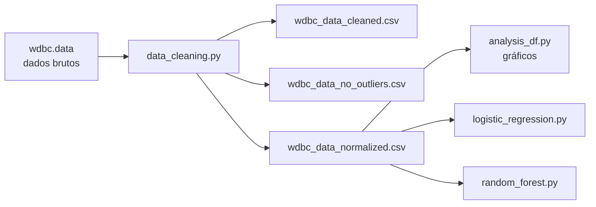

# 🩺 Classificação de Tumores de Mama com Machine Learning

Projeto de **Machine Learning** para classificação de tumores de mama como **benignos** ou **malignos**, utilizando o dataset **Wisconsin Diagnostic Breast Cancer (WDBC)**. O projeto cobre todo o fluxo de um problema de classificação: limpeza e normalização dos dados, análise exploratória com visualizações, e treinamento e avaliação de modelos de classificação.

---

## 📑 Sumário

- [Sobre o Projeto](#-sobre-o-projeto)
- [O Dataset (WDBC)](#-o-dataset-wdbc)
- [Pipeline do Projeto](#-pipeline-do-projeto)
- [Tecnologias](#-tecnologias)
- [Estrutura do Projeto](#-estrutura-do-projeto)
- [Como Executar](#-como-executar)
- [Modelos e Avaliação](#-modelos-e-avaliação)
- [Possíveis Melhorias](#-possíveis-melhorias)

---

## 📖 Sobre o Projeto

O objetivo é prever se um tumor de mama é **benigno (B)** ou **maligno (M)** a partir de características extraídas de imagens digitalizadas de aspirados por agulha fina (FNA) de massas mamárias.

O projeto está organizado em três etapas independentes:

1. **Tratamento dos dados** (`src/data`) — limpeza, remoção de outliers e normalização;
2. **Análise exploratória** (`src/analysis`) — geração de gráficos para entender a distribuição das classes e o poder discriminativo dos atributos;
3. **Modelagem** (`src/models`) — treinamento e avaliação de dois modelos de classificação.

---

## 📊 O Dataset (WDBC)

O **Wisconsin Diagnostic Breast Cancer** é um conjunto de dados clássico, criado por pesquisadores da University of Wisconsin (1995).

| Característica | Valor |
|---|---|
| **Amostras** | 569 |
| **Classes** | Benigno (357) · Maligno (212) |
| **Atributos** | 30 features numéricas |
| **Alvo** | `diagnosis` (B / M) |

Cada tumor é descrito por **10 atributos base**, computados para o núcleo celular:

`radius`, `texture`, `perimeter`, `area`, `smoothness`, `compactness`, `concavity`, `concave_points`, `symmetry`, `fractal_dimension`

Para cada atributo base são calculadas **3 estatísticas** — a média (`_mean`), o erro padrão (`_se`) e o "pior" / maior valor (`_worst`) —, totalizando as 30 features.

---

## 🔄 Pipeline do Projeto



### 1. Tratamento de dados — `src/data/data_cleaning.py`

- Carrega os dados brutos (`wdbc.data`) e atribui os nomes das colunas;
- Remove a coluna `id`;
- Gera três versões processadas do dataset:
  - **`wdbc_data_cleaned.csv`** — dados limpos;
  - **`wdbc_data_no_outliers.csv`** — sem outliers (método do intervalo interquartil / IQR);
  - **`wdbc_data_normalized.csv`** — normalizado com `RobustScaler` (robusto a outliers).

### 2. Análise exploratória — `src/analysis/analysis_df.py`

Gera e salva visualizações em `docs/figures/` para os conjuntos `raw` e `processed`:

- **Distribuição das classes** — quantidade de tumores benignos vs. malignos;
- **Boxplots** — comparação dos atributos mais discriminativos entre as classes;
- **Histogramas** — distribuição de cada atributo por classe (com curva de densidade).

### 3. Modelagem — `src/models/`

Treina e avalia dois classificadores sobre o dataset normalizado.

---

## 🛠 Tecnologias

| Biblioteca | Uso |
|---|---|
| **Python 3** | Linguagem principal |
| **pandas** | Manipulação e análise dos dados |
| **scikit-learn** | Modelos, normalização, divisão treino/teste e métricas |
| **matplotlib** | Visualização de dados |
| **seaborn** | Gráficos estatísticos (boxplots, histogramas, countplots) |

---

## 📂 Estrutura do Projeto

```
breast_cancer_classification/
├── data/
│   ├── raw/
│   │   ├── wdbc.data                    # Dataset original (bruto)
│   │   └── wdbc.names                   # Descrição do dataset
│   └── processed/
│       ├── wdbc_data_cleaned.csv        # Dados limpos
│       ├── wdbc_data_no_outliers.csv    # Sem outliers (IQR)
│       └── wdbc_data_normalized.csv     # Normalizado (RobustScaler)
├── docs/
│   └── figures/
│       ├── raw/                         # Gráficos dos dados brutos
│       └── processed/                   # Gráficos dos dados processados
├── src/
│   ├── data/
│   │   └── data_cleaning.py             # Limpeza, outliers e normalização
│   ├── analysis/
│   │   └── analysis_df.py               # Análise exploratória (EDA)
│   └── models/
│       ├── logistic_regression.py       # Modelo de Regressão Logística
│       └── random_forest.py             # Modelo Random Forest
└── README.md
```

---

## 🚀 Como Executar

### Pré-requisitos

- **Python 3.9+**
- Bibliotecas: `pandas`, `scikit-learn`, `matplotlib`, `seaborn`

```bash
# Clonar o repositório
git clone https://github.com/caua-an/breast_cancer_classification.git
cd breast_cancer_classification

# (Opcional) criar ambiente virtual
python -m venv venv
source venv/bin/activate        # Linux/macOS
# venv\Scripts\activate         # Windows

# Instalar as dependências
pip install pandas scikit-learn matplotlib seaborn
```

### Executando as etapas

> ⚠️ Execute os scripts a partir da **raiz do projeto**, pois os caminhos dos dados são relativos a ela.

```bash
# 1. Tratar os dados (gera os CSVs processados)
python src/data/data_cleaning.py

# 2. Gerar os gráficos da análise exploratória
python src/analysis/analysis_df.py

# 3. Treinar e avaliar os modelos
python src/models/logistic_regression.py
python src/models/random_forest.py
```

---

## 🤖 Modelos e Avaliação

Dois modelos de classificação são treinados sobre o dataset normalizado, ambos com a mesma metodologia:

- **Divisão treino/teste:** 80% / 20%, estratificada por classe (`stratify=y`);
- **Validação cruzada:** 5 folds (`cv=5`);
- **Reprodutibilidade:** `random_state=42`.

| Modelo | Configuração |
|---|---|
| **Regressão Logística** | `max_iter=1000` |
| **Random Forest** | `n_estimators=100` |

### Métricas calculadas

Para cada modelo são reportadas:

- **Accuracy**, **Precision**, **Recall** e **F1-score**;
- **Matriz de confusão**;
- **Relatório de classificação** completo (`classification_report`);
- **Top 10 atributos mais importantes** — via coeficientes (Regressão Logística) ou `feature_importances_` (Random Forest).

> 💡 Em diagnósticos médicos, o **Recall** da classe maligna é especialmente relevante, pois mede a capacidade do modelo de não deixar passar casos de câncer (falsos negativos).

---

> Projeto da matéria Inteligência Artificial usando Machine Learning aplicado ao diagnóstico de câncer de mama. 🎓
